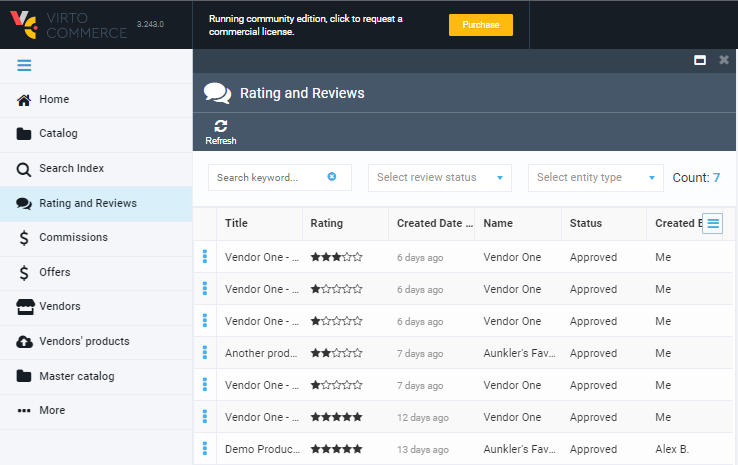

# Overview

[](https://github.com/VirtoCommerce/vc-module-customer-review/actions?query=workflow%3A"Module+CI") [](https://sonarcloud.io/dashboard?id=VirtoCommerce_vc-module-customer-review) [](https://sonarcloud.io/dashboard?id=VirtoCommerce_vc-module-customer-review) [](https://sonarcloud.io/dashboard?id=VirtoCommerce_vc-module-customer-review) [](https://sonarcloud.io/dashboard?id=VirtoCommerce_vc-module-customer-review)
 
The Product Rating and Reviews module presents the ability to customers to add reviews and ratings to products.
 
In Admin Portal, you can manage customers’ ratings and reviews to moderate content and collect information before publishing them live.
 
Rating information can be used for sorting and filtering products. Product ratings and reviews can be displayed for customers on demand.
 
!!! note
    70% of online shoppers say that the reviews are a decision maker for the purchase.
 
## Key features
* Submite a product review.
* Update existing product review.
* Get products ratings.
* View products reviews.
* Multi-store capability, every store has own review for same products.
* Moderate/checking reviews.
* Configurable rating calculator: Average and [Wilson](https://www.evanmiller.org/how-not-to-sort-by-average-rating.html). 
* Email review reminder for customers who have purchased products, reminding them to come back and leave a review.
 
## Current constraints
* Product reviews are linked to the store.
* One review per one customer for one product and store.
 
 
## Scenarios

!!! note
    You need to integrate Product Rating and Reviews API with your frontend application if you want to get access to some scenarios.
 
### Submite a Product Review
As a Customer, I want to submit a new product review, so that provide my feedback and improve decision maker for the purchase.
 
No Admin Portal UI for submitting a product review.
 
From frontend application, you call API and submit a new product review like this:
 
```json
POST /api/customerReviews
 
[
  {
    "storeId": "B2B-store",
    "userId": "test_user_id",
    "userName": "Alex B.",
    "productId": "baa4931161214690ad51c50787b1ed94",
    "title": "Demo Product Review",
    "review": "Nice Product. I liked it",
    "rating": 5
  }
]
```
 
 
### Get Products Ratings
As a Customer, I want to get new products rating, so that I can make a decision for the purchase.
 
You can quickly navigate to the Catalog, Product blade and see product rating in the Admin Portal.
 

 
From frontend application, you call API and request current rating for multiple products and specific store:
 
```json
POST /api/rating/productRatingInStore
 
{
  "storeId": "B2B-store",
  "productIds": [
    "baa4931161214690ad51c50787b1ed94"
  ]
}
 
Response:
[
  {
    "productId": "baa4931161214690ad51c50787b1ed94",
    "value": 4.5,
    "reviewCount": 4
  }
]
```
 
 
### View Products Reviews
As a Customer, I want to get product reviews on the product page, so that I can make a decision for the purchase.
 
A manager can quickly navigate to the Catalog, Product blade and see product rating in the Admin Portal.
 

 
 
From frontend application, you call API and request current rating for multiple products and specific store:

```json
POST /api/customerReviews/reviewList
 
{
    "productIds":["baa4931161214690ad51c50787b1ed94"],
    "storeId":"B2B-store",
    "reviewStatus":[1],
    "sort":"",
    "take":20,
    "skip":0,
}
 
Response:
{
    "totalCount":1,
    "results":[
        {
            "id":"fc9a07db-f09f-4a85-bafc-f5e9299d3301",
            "productName":"1\" Stainless Steel Carriage Bolt, 18-8, NL-19(SM) Finish, 1/4\"-20 Dia/Thread Size, 50 PK",
            "reviewStatus":"Approved",
            "reviewStatusId":1,
            "title": "Demo Product Review",
            "review": "Nice Product. I liked it",
            "rating":5,
            "userName":"Alex B.",
            "storeName":"B2B-store",
            "createdDate":"2022-01-31T14:09:15.491305Z"
        }
    ]
}
```
 
 
### Moderate/Checking Reviews
As a Category Manager, I want to review and moderate product reviews so that I can prevent from the spam.
 
!!! note
    Moderation process can be customized based on solution requirements.
 
Before changing the status, you can first read its contents.
 
To read a review, select Product Rating and Reviews. Apply filter, sorting.
 

 
You can change the statuses of the reviews that have been submitted by the customers of your shop.
 
To change the status of a review:
1. Open review
1. In the Toolbar, click: Approve Review or Reject Review.
 

 
You could not delete a review in Admin Portal, but this feature is available by API.
 
From frontend application, you call API:
 
```json
POST 
​/api​/customerReviews​/approve
 
[
    "fc9a07db-f09f-4a85-bafc-f5e9299d3301"
]
```
 
```json
POST 
/api/customerReviews/reject
 
[
    "fc9a07db-f09f-4a85-bafc-f5e9299d3301"
]
```
 
 
### Email Review Reminder
As a Category Manager, I want to configure email review reminder for customers who have purchased products, so that reminding them to come back and leave a review.
 
Before activating Email Review Reminder, you need to configure/customize Email template.
 

 
To customize Email Review Reminder template, select Notifications, Notification list, Order request review notification.
 
Also, you can customize Email Review Reminder template for store. Select Store, Notifications, Notification list, Order request review notification. 
 
After this, you can activate Email Review Reminder in Settings, Product Review, Email Review Reminder section. By default, this feature is disabled.
 

 
 
## Settings

### General
* Rating calculation method - allows to select rating mechanics: Average and [Wilson](https://www.evanmiller.org/how-not-to-sort-by-average-rating.html).
 
### Store
* Product reviews enabled. By default, false.
* Allow anonymous to submit product reviews. By default, false.
* Only customer who bought product can create new review. By default, true.
 
### Email Review Reminder
* Enable job to send e-mails request a review to customer when order in state at x days. By default, false.
* Cron expression for processing job execution. By default, every 15 minutes.
* Order state at x days. By default, 10 days.
* Order state to send mails. By default, Completed.
* Max e-mails sent to customer. By default, 2.
